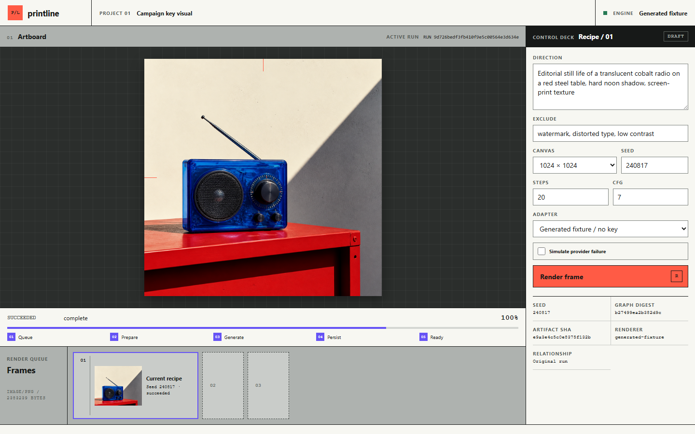

# Printline

Printline is a generative-media production workflow: configure a campaign key
visual, queue it, follow its execution stages, and inspect the resulting media
with reproducibility metadata. The complete orchestration path runs without an
API key, GPU, or model download, while an optional adapter sends the same
parameterized graph to ComfyUI.

## Render workflow

Each production recipe moves through a queue with its graph, seed, settings,
execution state, retry relationship, media artifact, and hashes recorded for
the run.
The interface is an image-dominant render workstation: a central artboard,
compact recipe deck, execution transport, and output filmstrip.



[Open the live render workstation](https://sutasmantas.github.io/comfyui-image-workflow/)

## Quickstart (no dependencies)

Requires Python 3.11 or newer.

```powershell
python -m unittest discover -s tests -v
python scripts\smoke_workflow.py
python main.py
```

Open `http://127.0.0.1:8042`, keep **Prepared render / no key** selected, and
send the default recipe to the line. Reusing the fixture produces the same
artifact SHA while the parameterized recipe produces a stable workflow digest.
Enable **Simulate provider failure** to see the safe failure state and retry path.

The prepared render at `printline/fixtures/campaign-radio-showcase.png` travels
through the queue, artifact, provenance, failure, and retry paths.

## Optional live ComfyUI adapter

The live adapter uses ComfyUI's API contract: an API-format graph is submitted
through `/prompt`, progress and
completion arrive through `/ws`, results are resolved through
`/history/{prompt_id}`, and the artifact is retrieved from `/view`.

```powershell
python -m pip install -r requirements.txt
$env:COMFYUI_ADDRESS="127.0.0.1:8188"
python main.py
```

Start a compatible ComfyUI server separately, install the checkpoint named in
`workflows/base_workflow.json` (or change that node to a locally available
checkpoint), and choose **Live ComfyUI** in Printline.

## Verification

```powershell
python -m compileall -q printline tests scripts main.py
python -m unittest discover -s tests -v
python scripts\smoke_workflow.py
```

The standard-library server has no build step. `compileall` is the packaging
and syntax gate; the browser consumes checked-in static files directly.
